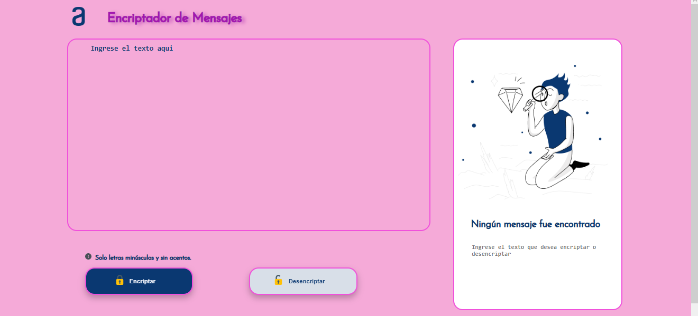
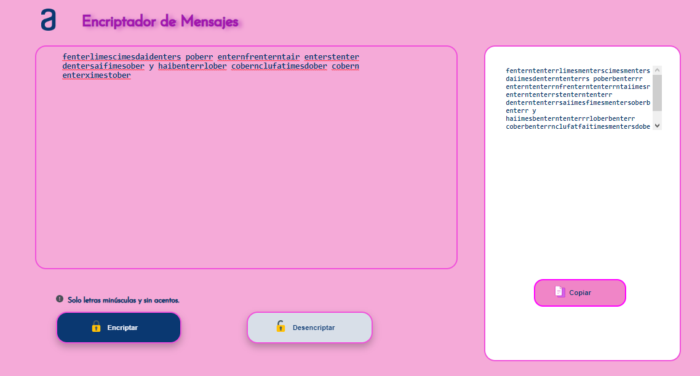
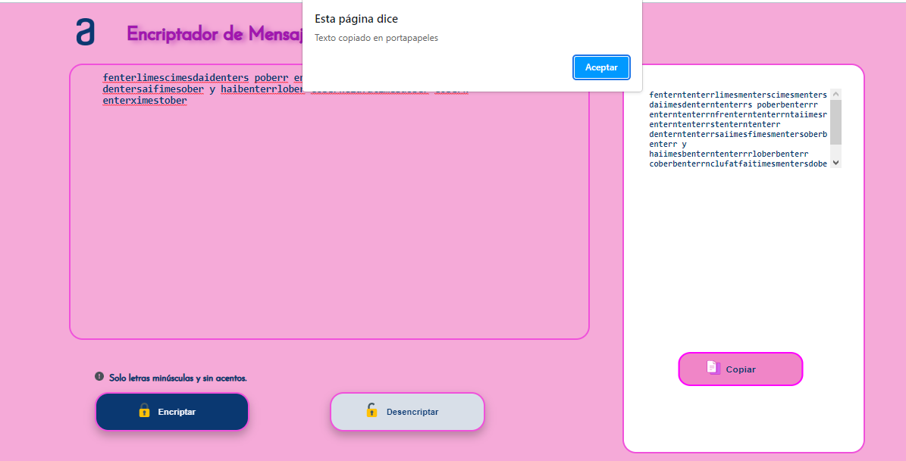
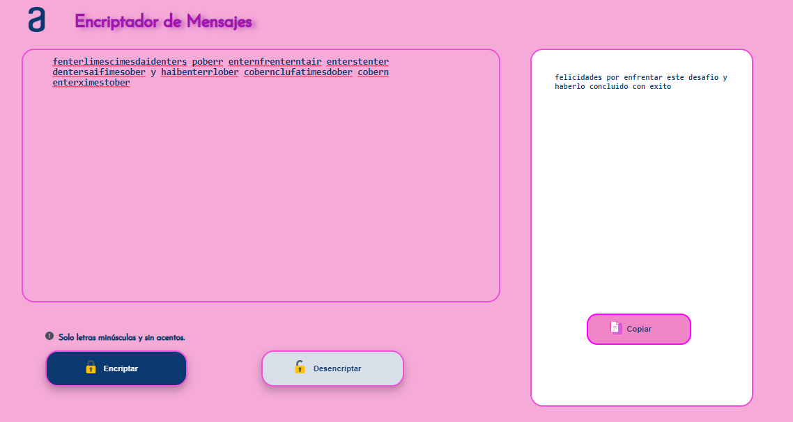

### <div align="center"> &#128274; &nbsp; Challenge ONE Principiante en programación. &#128274;</p>

#### <p align="center"> Realizado por Oracle y Alura LATAM </p>

### <div align="center">¿De qué trata este challenge? &nbsp; &#129300; </div>

#### <p>Encriptador de texto realizado para el challenge de Alura Latam - Oracle Next Education, el desafio consta en construir un encriptador de texto para que el usuario ingrese una frase y devuelva la misma encriptada, y a su vez la frase encriptada se pueda desencriptar.</p>

### <p> &#128161; DESCRIPCIÓN</p>

### <p> &#128273; &nbsp; Las "llaves" de encriptación que utilizaremos son las siguientes: </p>

```
- La letra "a" es convertida a "ai".
- La letra "e" es convertida a "enter".
- La letra "i" es convertida a "imes".
- La letra "o" es convertida a "ober"
- La letra "u" es convertida a "ufat"
```
### <p> &#9989; &nbsp; Requisitos </p>
```
- Debe funcionar solo con letras minúsculas
- No deben ser utilizados letras con acentos ni caracteres especiales
- Debe ser posible convertir una palabra para la versión encriptada también devolver una palabra encriptada para su versión original.
```
### <p> &#10145; &nbsp; Por ejemplo: </p>
```
"gato" => "gaitober"
"gaitober" => "gato"

La página debe tener campos para
inserción del texto que será encriptado o desencriptado, y el usuario debe poder escoger entre las dos opciones.
El resultado debe ser mostrado en la pantalla.
```
### <p> &#128204; &nbsp; Extras </p>
```
- Un botón que copie el texto encriptado/desencriptado para la sección de transferencia, o sea que tenga la misma funcionalidad del ctrl+C o de la opción "copiar" del menú de las aplicaciones.
```
### <p> &#128203; &nbsp; Mensaje secreto </p>
```
Desencripta nuestro mensaje secreto!

fenterlimescimesdaidenters poberr enternfrenterntair enterstenter dentersaifimesober y haibenterrlober cobernclufatimesdober cobern enterximestober!

```
### Este challenge se realizó con:
<a href="https://www.w3.org/html/" target="_blank"></a>
<a href="https://www.w3schools.com/css/" target="_blank"></a>
<a href="https://developer.mozilla.org/en-US/docs/Web/JavaScript" target="_blank"></a>

#### <p> &#128269; &nbsp; Puedes visualizar un poco de mi proyecto observando las siguientes imágenes: </p>

 &nbsp; &nbsp;  &nbsp; &nbsp;  &nbsp; &nbsp; 
</p>

#### <p> 	&#128456; &nbsp; Espero que os haya gustado &#129321; </p>

#### <p align="center">&starf; Desarrollado por Fatima Villegas &starf; </p>
#### <p align="center"> &copy; Copyright-Todos los derechos reservados - 2023</p>
#### <p align="center"></p>
